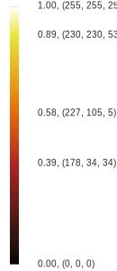

+++
title = 'Color Map Advice for Scientific Visualization'
+++

This page provides advice for using colors in scientific visualization. More
specifically, this page provides color maps that you can use while using
pseudocoloring of a scalar field. The color maps are organized by how and where
they are best used. Each color map shows some example usage and provides color
tables in CSV format so that they can readily be used in rendering system
textures or entered into visualization software. For simplicity, the color
tables are provided in many different lengths and with colors expressed in both
bytes (integers between 0 and 255) and floats (decimals between 0.0 and 1.0).
Each color map also has instructions on getting these colors in the [ParaView
visualization application]. Where applicable, Jupyter Python notebooks containing
details about how each color map is generated. You can either run the code
directly with the [appropriate software] or copy/paste scripts into your own
interpreter. Each color map below is demonstrated on a 2D heat map and 3D
surface. The data for both can be downloaded here.

This work originates from the paper "{}[Why We Use Bad Color Maps
and What You Can Do About It](#publication){}." Details about
this paper are given below. Another related publication is "{}[Diverging Color Maps for Scientific Visualization](/color-maps/){}," which describes specifics about one particular type of color
map. Details of this paper and the techniques used can be found on its
[companion page](/color-maps/).

[ParaView visualization application]: https://www.paraview.org/
[appropriate software]: https://ipython.org/notebook.html

Below is a collection of color maps that you can use to apply in scientific
visualization.

A note about license. All original color maps on this page are released as
[public domain (CC0)]. I waive all copyrights and related rights so that these
color maps may be used freely. However, please note that much of this work is
borrowed or derivative. I have avoided works where someone has exercised private
intellectual property rights and kept to open work, but some of these color maps
might be covered under other licensing agreements. I make my best effort to
identify the source of any borrowed or derivative work and the respective
license.

[public domain (CC0)]: https://creativecommons.org/publicdomain/zero/1.0/

## 3D Surface Color Maps

In general a color map should use changes in luminance (brightness) to
communicate changes in value. However, in a 3D scene, shading cues, which are
themselves changes in brightness, are vital to understanding shapes. Thus, you
have to avoid having the brightness changes in the color map interfere with the
brightness changes in shading and vice versa. You achieve this by limiting the
color map to reasonably bright colors. Because this reduces the total range of
brightness in the color map, I find it most effective to use a diverging
(double-ended) color map.

### Fast

This color map was designed to be the [default colormap] in the ParaView
scientific visualization tool. (Publication coming soon.) It is a diverging
(double-ended) color map with a smooth transition in the middle to prevent
artifacts at the midpoint. This colormap is designed to be used on 3D surfaces,
so it avoids getting too dark at the ends (although it does get somewhat dark to
extend discriminability).

Color Tables (byte):
[   8](fast/fast-table-byte-0008.csv)
[  16](fast/fast-table-byte-0016.csv)
[  32](fast/fast-table-byte-0032.csv)
[  64](fast/fast-table-byte-0064.csv)
[ 128](fast/fast-table-byte-0128.csv)
[ 256](fast/fast-table-byte-0256.csv)
[ 512](fast/fast-table-byte-0512.csv)
[1024](fast/fast-table-byte-1024.csv)

Color Tables (float):
[   8](fast/fast-table-float-0008.csv)
[  16](fast/fast-table-float-0016.csv)
[  32](fast/fast-table-float-0032.csv)
[  64](fast/fast-table-float-0064.csv)
[ 128](fast/fast-table-float-0128.csv)
[ 256](fast/fast-table-float-0256.csv)
[ 512](fast/fast-table-float-0512.csv)
[1024](fast/fast-table-float-1024.csv)

[Download all color tables.](fast/fast-tables.zip)

This color map is available in ParaView as the "Fast" preset.

[Python code to generate these colors.](https://github.com/kennethmoreland-com/kennethmoreland-com.github.io/blob/master/color-advice/fast/fast.ipynb)

This color map was first featured in ParaView and is covered by [its BSD
license](https://www.paraview.org/paraview-license/).

[default colormap]: https://1drv.ms/b/s!Aub-LzOy6dCvitkA32iJZCpkRqay2g?e=Iysa1r

### Smooth Cool Warm

This color map uses the techniques based on "[Diverging Color Maps for
Scientific Visualization](/color-maps/)" by Kenneth Moreland. It is a diverging
(double-ended) color map with a smooth transition in the middle to prevent
artifacts at the midpoint. There are several more color maps of a similar nature
[described here](/color-maps/). Although not isoluminant, this color map avoids
dark colors to allow shading cues throughout.

This colormap has been superseded by [Fast](#fast), which has a similar color profile but better discriminability. I suggest using those colors instead.

Color Tables (byte):
[   8](smooth-cool-warm/smooth-cool-warm-table-byte-0008.csv)
[  16](smooth-cool-warm/smooth-cool-warm-table-byte-0016.csv)
[  32](smooth-cool-warm/smooth-cool-warm-table-byte-0032.csv)
[  64](smooth-cool-warm/smooth-cool-warm-table-byte-0064.csv)
[ 128](smooth-cool-warm/smooth-cool-warm-table-byte-0128.csv)
[ 256](smooth-cool-warm/smooth-cool-warm-table-byte-0256.csv)
[ 512](smooth-cool-warm/smooth-cool-warm-table-byte-0512.csv)
[1024](smooth-cool-warm/smooth-cool-warm-table-byte-1024.csv)

Color Tables (float):
[   8](smooth-cool-warm/smooth-cool-warm-table-float-0008.csv)
[  16](smooth-cool-warm/smooth-cool-warm-table-float-0016.csv)
[  32](smooth-cool-warm/smooth-cool-warm-table-float-0032.csv)
[  64](smooth-cool-warm/smooth-cool-warm-table-float-0064.csv)
[ 128](smooth-cool-warm/smooth-cool-warm-table-float-0128.csv)
[ 256](smooth-cool-warm/smooth-cool-warm-table-float-0256.csv)
[ 512](smooth-cool-warm/smooth-cool-warm-table-float-0512.csv)
[1024](smooth-cool-warm/smooth-cool-warm-table-float-1024.csv)

[Download all color tables.](smooth-cool-warm/smooth-cool-warm-tables.zip)

This color map is available in ParaView as the "Cool to Warm" preset.

[Python code to generate these colors.](https://github.com/kennethmoreland-com/kennethmoreland-com.github.io/blob/master/color-advice/smooth-cool-warm/smooth-cool-warm.ipynb)

This color map was first featured in ParaView and is covered by [its BSD
license](https://www.paraview.org/paraview-license/).

### Bent Cool Warm

This is a similar color map to the previous except that the luminance is
interpolated linearly with a sharp bend in the middle. This makes for less
washed out colors in the middle, but also creates an artifact at the midpoint.

This colormap has been superseded by [Fast](#fast), which has a similar color
profile but better smoothness. I suggest using those colors instead.

Color Tables (byte):
[   8](bent-cool-warm/bent-cool-warm-table-byte-0008.csv)
[  16](bent-cool-warm/bent-cool-warm-table-byte-0016.csv)
[  32](bent-cool-warm/bent-cool-warm-table-byte-0032.csv)
[  64](bent-cool-warm/bent-cool-warm-table-byte-0064.csv)
[ 128](bent-cool-warm/bent-cool-warm-table-byte-0128.csv)
[ 256](bent-cool-warm/bent-cool-warm-table-byte-0256.csv)
[ 512](bent-cool-warm/bent-cool-warm-table-byte-0512.csv)
[1024](bent-cool-warm/bent-cool-warm-table-byte-1024.csv)

Color Tables (float):
[   8](bent-cool-warm/bent-cool-warm-table-float-0008.csv)
[  16](bent-cool-warm/bent-cool-warm-table-float-0016.csv)
[  32](bent-cool-warm/bent-cool-warm-table-float-0032.csv)
[  64](bent-cool-warm/bent-cool-warm-table-float-0064.csv)
[ 128](bent-cool-warm/bent-cool-warm-table-float-0128.csv)
[ 256](bent-cool-warm/bent-cool-warm-table-float-0256.csv)
[ 512](bent-cool-warm/bent-cool-warm-table-float-0512.csv)
[1024](bent-cool-warm/bent-cool-warm-table-float-1024.csv)

[Download all color tables.](bent-cool-warm/bent-cool-warm-tables.zip)

[Download ParaView color map file.](bent-cool-warm/bent-cool-warm-paraview-colors.json)

[Python code to generate these colors.](https://github.com/kennethmoreland-com/kennethmoreland-com.github.io/blob/master/color-advice/bent-cool-warm/bent-cool-warm.ipynb)

This color map is derivative of the cool to warm and might be covered under
[ParaView's BSD license](https://www.paraview.org/paraview-license/).

### Viridis

Viridis is a perceptually uniform color map with monotonically increasing
luminance and a pleasant smooth arc through blue, green, and yellow hues.
Viridis is one of the [matplotlib color maps], originally contributed by Eric
Firing. Although none of the colors in viridis reach black, the bottom end of
the scale does get dark, so map might need to be shortened for some 3D
applications. Viridis shares similarities with (but is noticeably different
from) MATLAB's [parula] (which is not freely available). Pacific Northwest
National Laboratory's [cividis] adjusts viridis to compensate for color vision
deficiencies. Although viridis is very perceptually smooth and monotonically
increasing, it does not have as much discrimination as other color maps.

Color Tables (byte):
[   8](viridis/viridis-table-byte-0008.csv)
[  16](viridis/viridis-table-byte-0016.csv)
[  32](viridis/viridis-table-byte-0032.csv)
[  64](viridis/viridis-table-byte-0064.csv)
[ 128](viridis/viridis-table-byte-0128.csv)
[ 256](viridis/viridis-table-byte-0256.csv)
[ 512](viridis/viridis-table-byte-0512.csv)
[1024](viridis/viridis-table-byte-1024.csv)

Color Tables (float):
[   8](viridis/viridis-table-float-0008.csv)
[  16](viridis/viridis-table-float-0016.csv)
[  32](viridis/viridis-table-float-0032.csv)
[  64](viridis/viridis-table-float-0064.csv)
[ 128](viridis/viridis-table-float-0128.csv)
[ 256](viridis/viridis-table-float-0256.csv)
[ 512](viridis/viridis-table-float-0512.csv)
[1024](viridis/viridis-table-float-1024.csv)

[Download all color tables.](viridis/viridis-tables.zip)

This color map is available in ParaView as the "Viridis" preset.

[Python code to generate these colors.](https://github.com/kennethmoreland-com/kennethmoreland-com.github.io/blob/master/color-advice/viridis/viridis.ipynb)

This color map was first featured in the matplotlib library and is covered by
[matplotlib's BSD-compatible license].

[matplotlib color maps]: https://bids.github.io/colormap/
[parula]: https://www.mathworks.com/help/matlab/ref/parula.html
[cividis]: https://journals.plos.org/plosone/article?id=10.1371/journal.pone.0199239
[matplotlib's BSD-compatible license]: https://matplotlib.org/users/license.html

### Plasma

Plasma is a perceptually uniform color map with monotonically increasing
luminance and a pleasant smooth arc through blue, purple, and yellow hues.
Plasma is one of the [matplotlib color maps] developed by Stéfan van der Walt
and Nathaniel Smith. Although none of the colors in plasma reach black, the
bottom end of the scale does get dark, so map might need to be shortened for
some 3D applications. [Inferno](#inferno) is a similar color map that extends
the lower range all the way to black for 2D heat maps.

Color Tables (byte):
[   8](plasma/plasma-table-byte-0008.csv)
[  16](plasma/plasma-table-byte-0016.csv)
[  32](plasma/plasma-table-byte-0032.csv)
[  64](plasma/plasma-table-byte-0064.csv)
[ 128](plasma/plasma-table-byte-0128.csv)
[ 256](plasma/plasma-table-byte-0256.csv)
[ 512](plasma/plasma-table-byte-0512.csv)
[1024](plasma/plasma-table-byte-1024.csv)

Color Tables (float):
[   8](plasma/plasma-table-float-0008.csv)
[  16](plasma/plasma-table-float-0016.csv)
[  32](plasma/plasma-table-float-0032.csv)
[  64](plasma/plasma-table-float-0064.csv)
[ 128](plasma/plasma-table-float-0128.csv)
[ 256](plasma/plasma-table-float-0256.csv)
[ 512](plasma/plasma-table-float-0512.csv)
[1024](plasma/plasma-table-float-1024.csv)

[Download all color tables.](plasma/plasma-tables.zip)

This color map is available in ParaView as the "Plasma" preset.

[Python code to generate these colors.](https://github.com/kennethmoreland-com/kennethmoreland-com.github.io/blob/master/color-advice/plasma/plasma.ipynb)

This color map was first featured in the matplotlib library and is covered by
[matplotlib's BSD-compatible license].

## 2D Image Color Maps

When pseudocoloring is applied to the flat surface of the image, you do not have
to contend with 3D shading. In this case, you are free to use the entire range
of brightness from completely dark to full white. These color maps take
advantage of that extra range.

### Black Body

The black body color map is based on colors from [black-body radiation]. The
colors are are not exact to those of black-body radiation but are designed to
have a constant increase in brightness throughout.

The black body color map based on the colors of black body radiation. Although
the colors are inspired by the wavelengths of light from black body radiation,
the actual colors used are designed to be perceptually uniform. Colors of the
desired brightness and hue are chosen, and then the colors are adjusted such
that the luminance is perceptually linear (according to the CIELAB color space).

Color Tables (byte):
[   8](black-body/black-body-table-byte-0008.csv)
[  16](black-body/black-body-table-byte-0016.csv)
[  32](black-body/black-body-table-byte-0032.csv)
[  64](black-body/black-body-table-byte-0064.csv)
[ 128](black-body/black-body-table-byte-0128.csv)
[ 256](black-body/black-body-table-byte-0256.csv)
[ 512](black-body/black-body-table-byte-0512.csv)
[1024](black-body/black-body-table-byte-1024.csv)

Color Tables (float):
[   8](black-body/black-body-table-float-0008.csv)
[  16](black-body/black-body-table-float-0016.csv)
[  32](black-body/black-body-table-float-0032.csv)
[  64](black-body/black-body-table-float-0064.csv)
[ 128](black-body/black-body-table-float-0128.csv)
[ 256](black-body/black-body-table-float-0256.csv)
[ 512](black-body/black-body-table-float-0512.csv)
[1024](black-body/black-body-table-float-1024.csv)

[Download all color tables.](black-body/black-body-tables.zip)

[Download ParaView color map file.](black-body/black-body-paraview-colors.json)

[Python code to generate these colors.](https://github.com/kennethmoreland-com/kennethmoreland-com.github.io/blob/master/color-advice/black-body/black-body.ipynb)

Variations of this color map have been in literature [at least as far back as
1983]. To the best of my knowledge, no one claims intellectual property on these
colors.

[black-body radiation]: https://en.wikipedia.org/wiki/Black-body_radiation
[at least as far back as 1983]: https://doi.org/10.1016/0301-5629(83)90086-8

### Inferno

Inferno is a perceptually uniform color map with monotonically increasing
luminance. It is similar to black body but also adds some purple hues for a more
appealing display. Inferno is one of the [matplotlib color maps] developed by
Stéfan van der Walt and Nathaniel Smith. [Plasma](#plasma) is a similar color
map that removes the lower black colors to make it more appropriate for 3D
surfaces.

Color Tables (byte):
[   8](inferno/inferno-table-byte-0008.csv)
[  16](inferno/inferno-table-byte-0016.csv)
[  32](inferno/inferno-table-byte-0032.csv)
[  64](inferno/inferno-table-byte-0064.csv)
[ 128](inferno/inferno-table-byte-0128.csv)
[ 256](inferno/inferno-table-byte-0256.csv)
[ 512](inferno/inferno-table-byte-0512.csv)
[1024](inferno/inferno-table-byte-1024.csv)

Color Tables (float):
[   8](inferno/inferno-table-float-0008.csv)
[  16](inferno/inferno-table-float-0016.csv)
[  32](inferno/inferno-table-float-0032.csv)
[  64](inferno/inferno-table-float-0064.csv)
[ 128](inferno/inferno-table-float-0128.csv)
[ 256](inferno/inferno-table-float-0256.csv)
[ 512](inferno/inferno-table-float-0512.csv)
[1024](inferno/inferno-table-float-1024.csv)

[Download all color tables.](inferno/inferno-tables.zip)

This color map is available in ParaView as the "Inferno" preset.

[Python code to generate these colors.](https://github.com/kennethmoreland-com/kennethmoreland-com.github.io/blob/master/color-advice/inferno/inferno.ipynb)

This color map was first featured in the matplotlib library and is covered by
[matplotlib's BSD-compatible license].

### Kindlmann

The Kindlmann color map uses the colors first proposed in [a paper by Kindlmann, Reinhard, and Creem]. The map is basically the rainbow color map with the luminance adjusted such that it monotonically changes, making it much more perceptually viable.

Color Tables (byte):
[   8](kindlmann/kindlmann-table-byte-0008.csv)
[  16](kindlmann/kindlmann-table-byte-0016.csv)
[  32](kindlmann/kindlmann-table-byte-0032.csv)
[  64](kindlmann/kindlmann-table-byte-0064.csv)
[ 128](kindlmann/kindlmann-table-byte-0128.csv)
[ 256](kindlmann/kindlmann-table-byte-0256.csv)
[ 512](kindlmann/kindlmann-table-byte-0512.csv)
[1024](kindlmann/kindlmann-table-byte-1024.csv)

Color Tables (float):
[   8](kindlmann/kindlmann-table-float-0008.csv)
[  16](kindlmann/kindlmann-table-float-0016.csv)
[  32](kindlmann/kindlmann-table-float-0032.csv)
[  64](kindlmann/kindlmann-table-float-0064.csv)
[ 128](kindlmann/kindlmann-table-float-0128.csv)
[ 256](kindlmann/kindlmann-table-float-0256.csv)
[ 512](kindlmann/kindlmann-table-float-0512.csv)
[1024](kindlmann/kindlmann-table-float-1024.csv)

[Download all color tables.](kindlmann/kindlmann-tables.zip)

[Download ParaView color map file.](kindlmann/kindlmann-paraview-colors.json)

[Python code to generate these colors.](https://github.com/kennethmoreland-com/kennethmoreland-com.github.io/blob/master/color-advice/kindlmann/kindlmann.ipynb)

Since the original proposal, this color map has been used in numerous scientific
works and software products. To the best of my knowledge, no one claims
intellectual property on this color map.

[a paper by Kindlmann, Reinhard, and Creem]: https://doi.org/10.1109/VISUAL.2002.1183788

### Extended Kindlmann

The extended Kindlmann color map uses the colors from Kindlmann but also adds
more hues by doing a more than 360 degree loop around the hues. This works
because the endpoints have low saturation and very different brightness.

Color Tables (byte):
[   8](extended-kindlmann/extended-kindlmann-table-byte-0008.csv)
[  16](extended-kindlmann/extended-kindlmann-table-byte-0016.csv)
[  32](extended-kindlmann/extended-kindlmann-table-byte-0032.csv)
[  64](extended-kindlmann/extended-kindlmann-table-byte-0064.csv)
[ 128](extended-kindlmann/extended-kindlmann-table-byte-0128.csv)
[ 256](extended-kindlmann/extended-kindlmann-table-byte-0256.csv)
[ 512](extended-kindlmann/extended-kindlmann-table-byte-0512.csv)
[1024](extended-kindlmann/extended-kindlmann-table-byte-1024.csv)

Color Tables (float):
[   8](extended-kindlmann/extended-kindlmann-table-float-0008.csv)
[  16](extended-kindlmann/extended-kindlmann-table-float-0016.csv)
[  32](extended-kindlmann/extended-kindlmann-table-float-0032.csv)
[  64](extended-kindlmann/extended-kindlmann-table-float-0064.csv)
[ 128](extended-kindlmann/extended-kindlmann-table-float-0128.csv)
[ 256](extended-kindlmann/extended-kindlmann-table-float-0256.csv)
[ 512](extended-kindlmann/extended-kindlmann-table-float-0512.csv)
[1024](extended-kindlmann/extended-kindlmann-table-float-1024.csv)

[Download all color tables.](extended-kindlmann/extended-kindlmann-tables.zip)

[Download ParaView color map file.](extended-kindlmann/extended-kindlmann-paraview-colors.json)

[Python code to generate these colors.](https://github.com/kennethmoreland-com/kennethmoreland-com.github.io/blob/master/color-advice/extended-kindlmann/extended-kindlmann.ipynb)

This color map is a derivative of the Kindlmann color map. Any other
similarities to other color maps are coincidental.

## Other Resources

### Color Brewer

The web-based Color Brewer tool, available at https://colorbrewer2.org/, is an
excellent resource for choosing a collection of tools for a variety of uses.

### CET Perceptually Uniform Color Maps

Peter Kovesi from the Centre for Exploration Targeting (CET) provides a collection of perceptually uniform color maps as well as example code used for their generation and analysis at https://colorcet.com/.

### Sci Vis Color

Los Alamos National Laboratory and the Texas Advanced Computing Center have
collaborated to provide some helpful tools and colormaps at
https://sciviscolor.org/. Several colormaps presented in related work are
available here.

### Color Picking Tools

If you are just looking for an interpolation of colors in a perceptual space
like Lab space but don't want to go through the trouble of doing all the color
conversions yourself, you can use [David Johnstone's gradient picker].

[David Johnstone's gradient picker]: https://davidjohnstone.net/pages/lch-lab-colour-gradient-picker

### Maps for Event Horizon Telescope

The team creating tools for visualizing readings from the Event Horizon Telescope present a [well thought out description] of the color maps used in their tools.

[well thought out description]: https://github.com/liamedeiros/ehtplot/blob/docs/docs/COLORMAPS.ipynb

### Color Blindness Simulator

It is always good practice to check the images you make to ensure that the colors are resiliant to color blindness. [Colblindor's color blindness simulator] provides a convenient way to check your images by simulating what your image will look like when viewed with different types of color blindness.

[Colblindor's color blindness simulator]: https://www.color-blindness.com/coblis-color-blindness-simulator/

## Publication

{}Why We Use Bad Color Maps and What You Can Do About It{}.
Kenneth Moreland.
In _Proceedings of Human Vision and Electronic Imaging (HVEI)_, February 2016.
[doi:10.2352/ISSN.2470-1173.2016.16.HVEI-133](https://dx.doi.org/10.2352/ISSN.2470-1173.2016.16.HVEI-133).

Abstract
We know the rainbow color map is terrible, and it is emphatically reviled by the visualization community, yet its use continues to persist. Why do we continue to use a this perceptual encoding with so many known flaws? Instead of focusing on why we should not use rainbow colors, this position statement explores the rational for why we do pick these colors despite their flaws. Often the decision is influenced by a lack of knowledge, but even experts that know better sometimes choose poorly. A larger issue is the expedience that we have inadvertently made the rainbow color map become. Knowing why the rainbow color map is used will help us move away from it. Education is good, but clearly not sufficient. We gain traction by making sensible color alternatives more convenient. It is not feasible to force a color map on users. Our goal is to supplant the rainbow color map as a common standard, and we will find that even those wedded to it will migrate away.

### Full Paper

{}[Why We Use Bad Color Maps and What You Can Do About It](BadColorMaps.pdf){}

## Related Works

* {}Diverging Color Maps for Scientific Visualization{}.
  Kenneth Moreland. In _Proceedings of the 5th International Symposium on
  Visual Computing_, December 2009. DOI
  [10.1007/978-3-642-10520-3_9](https://dx.doi.org/10.1007/978-3-642-10520-3_9).
  * Introduces the smooth diverging color maps.
* {}Face-Based Luminance Matching for Perceptual Colormap
  Generation{}. Gordon Kindlmann, Erik Reinhard, and Sarah Creem.
  In _Proceedings of IEEE Visualization_, pages 299–306, October 2002. DOI
  [10.1109/VISUAL.2002.1183788](https://dx.doi.org/10.1109/VISUAL.2002.1183788).
  * Originally proposed what we call the Kindlmann color map.
* {}The Rainbow is Dead... Long Live the Rainbow! - Perceptual
  Palettes, Part 5 - CIE LAB Linear L* Rainbow{}. Matteo Niccoli.
  MyCarta (blog post), December 2012.
  https://mycarta.wordpress.com/2012/12/06/the-rainbow-is-deadlong-live-the-rainbow-part-5-cie-lab-linear-l-rainbow/.
  * Proposes adjusting using luminance in CIELAB space rather than human input
    to build the Kindlmann color map. I used the same technique to build the
    color map posted on this page.
* {}A Colour Scheme for the Display of Astronomical Intensity
  Images{}. D. A. Green. _Bulletin of the Astronomical Society of
  India_, 39:289–295, 2011. [arXiv:1108.5083](https://arxiv.org/abs/1108.5083).
  * A proposed color map technique that creates a color spiral of monotonic
    luminance. Similar concepts were used in the Extended Kindlmann color map
    presented here although the techniques used are different.
