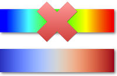

+++
title = 'Diverging Color Maps for Scientific Visualization'
+++

  

{}Diverging Color Maps for Scientific Visualization{}.
Kenneth Moreland.
In _Advances in Visual Computing (Proceedings of the 5th International Symposium on Visual Computing)_, 5876:92–103, December 2009.
[doi:10.1007/978-3-642-10520-3_9](https://dx.doi.org/10.1007/978-3-642-10520-3_9).

## Abstract

One of the most fundamental features of scientific visualization is the process
of mapping scalar values to colors. This process allows us to view scalar fields
by coloring surfaces and volumes. Unfortunately, the majority of scientific
visualization tools still use a color map that is famous for its
ineffectiveness: the rainbow color map. This color map, which naively sweeps
through the most saturated colors, is well known for its ability to obscure
data, introduce artifacts, and confuse users. Although many alternate color maps
have been proposed, none have achieved widespread adoption by the visualization
community for scientific visualization. This paper explores the use of diverging
color maps (sometimes also called ratio, bipolar, or double-ended color maps)
for use in scientific visualization, provides a diverging color map that
generally performs well in scientific visualization applications, and presents
an algorithm that allows users to easily generate their own customized color
maps.

## Full Paper

{}[Diverging Color Maps for Scientific Visualization
(Expanded)]{}: This version of the paper has some material in
addition to that of the original publication. There is more background
information and more figures to make the material easier to understand. There
are also some added algorithms and tables to make it easier to create the color
map. At one point I had all this fitting in 8 pages using two column formatting.
Unfortunately, the ISVC formatting is less compact and I had to dramatically cut
out material to get it to fit. If you wish, you can also view [the originally
published material].

[Diverging Color Maps for Scientific Visualization (Expanded)]: ColorMapsExpanded.pdf
[the originally published material]: ColorMaps.pdf

## Supplemental Materials

* These smooth diverging color maps are used in the following systems. Try them today.
  * [ParaView], a free, open-source, large-scale, general-purpose scientific
    visualization tool.
  * [Rgnuplot], an R interface for gnuplot.
  * [Gamera], a framework for building document analysis applications
    (represented in the false_color plugin).
  * [gencolormap], a simple tool for building color maps of different types.

[ParaView]: https://www.paraview.org/
[Rgnuplot]: https://cran.r-project.org/web/packages/Rgnuplot/
[Gamera]: https://gamera.informatik.hsnr.de/
[gencolormap]: https://github.com/marlam/gencolormap

* If you want to get started quickly with the cool/warm color map recommended in this paper, I have created some tables of values you can import directly into your application. I have stored the tables in CSV files. I provide both a small table containing 33 values and a large table containing 257 values. For each, I also have a version that defines color channels using unsigned bytes (integers in the range [0, 255]) and another that uses floats (real numbers in the range [0, 1]).
 	* [CoolWarmUChar33.csv](CoolWarmUChar33.csv)
    [CoolWarmUChar33.csv](CoolWarmUChar33.csv)
 	* [CoolWarmFloat33.csv](CoolWarmFloat33.csv)
    [CoolWarmFloat257.csv](CoolWarmFloat257.csv)

* [This Excel spreadsheet] is a convenient tool for designing and building diverging color maps.

[This Excel spreadsheet]: DivergingColorMapWorkshop.xls

* There are several examples of code for building these continuous diverging color maps.
  * An algorithm for building continuous diverging color maps is implemented in the [Visualization Toolkit (VTK)]. Specifically, the algorithm is in the vtkColorTransferFunction class.
    * [Here is some example code] that exercises the continuous diverging color
      map functionality (as well as other color maps) within VTK. This code was
      used to create several of the examples in this paper. Thanks to Andrew
      Maclean for updating the examples to VTK 6. Thanks to Anthony Cowley for
      updating the examples to VTK 8.
  * [This Python class] can be used to create diverging color maps in Python.
    (Thanks to Carlo Barth.)
  * [This Matlab function] can be used to create continuous diverging color maps in Matlab. (Thanks to Andrew Stein.)
  * [This R function] can be used to create continuous diverging color maps in
    R. (Part of the Rgnuplot package. Thanks to José Gama.)
  * [This Mathematica package] can be used to create diverging color maps in
    Mathematica. (Thanks to Jason Biggs. [Git repository
    here](https://github.com/jasondbiggs/DivergentColorMaps).)
  * [This gnuplot palette file] adapts the colors to gnuplot. I have seen
    multiple versions. This one originally comes from [Bastian Rieck]. Others
    can be seen in discussions such as
    [here](https://www.gnuplotting.org/tag/palette/) and
    [here](https://www.gnuplotting.org/default-color-map/).

[Visualization Toolkit (VTK)]: https://www.vtk.org
[Here is some example code]: ColorMapVTKExamples.tar.gz
[This Python class]: diverging_map.py
[This Matlab function]: diverging_map.m
[This R function]: diverging_map.R
[This Mathematica package]: diverging_map_mathematica.zip
[This gnuplot palette file]: diverging_map_gnuplot.pal
[Bastian Rieck]: https://bastian.rieck.ru/blog/posts/2012/gnuplot_better_colour_palettes/

* There are several examples of smooth diverging color maps in the paper that I
  did not adequately document. Here are the color maps in the paper with the RGB
  beginning and ending colors used. All of these examples use a midpoint value
  of 0.865, 0.865, 0.865.
| Min Color           | Bar        | Max Color           |
|---------------------|------------|---------------------|
| 0.230, 0.299, 0.754 |  | 0.706, 0.016, 0.150 |
| 0.436, 0.308, 0.631 |  | 0.759, 0.334, 0.046 |
| 0.085, 0.532, 0.201 |  | 0.436, 0.308, 0.631 |
| 0.217, 0.525, 0.910 |  | 0.677, 0.492, 0.093 |
| 0.085, 0.532, 0.201 |  | 0.758, 0.214, 0.233 |
