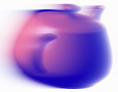

+++
title = 'The FFT on a GPU'
+++

  

{}The FFT on a GPU{}.
Kenneth Moreland and Edward Angel.
In _SIGGRAPH/Eurographics Workshop on Graphics Hardware 2003 Proceedings_, pages 112–119, July 2003.

## Abstract

The Fourier transform is a well known and widely used tool in many scientific
and engineering fields. The Fourier transform is essential for many image
processing techniques, including filtering, manipulation, correction, and
compression. As such, the computer graphics community could benefit greatly from
such a tool if it were part of the graphics pipeline. As of late, computer
graphics hardware has become amazingly cheap, powerful, and flexible. This paper
describes how to utilize the current generation of cards to perform the fast
Fourier transform (FFT) directly on the cards. We demonstrate a system that can
synthesize an image by conventional means, perform the FFT, filter the image,
and finally apply the inverse FFT in well under 1 second for a 512 by 512 image.
This work paves the way for performing complicated, real-time image processing
as part of the rendering pipeline.

## Publication

[Get the paper](fftgpu.pdf) by clicking this link. Note that in the original
publication in the workshop proceedings has an error in Equation 6. The
electronic form distributed here has a correction.

## Code

At the time of publication I archived the software I was using to test the
system and generate images.

* [Source code] providing a demo (also used to generate the images in the paper).
* [Windows binaries] of said demo.

I have not touched this code much since publishing the paper, so it is probably
out of date. So far no one has reported catastrophic problems that have not been
fixed, although I have heard of problems with rendering artifacts.[^segfault]
All that said, this code and the libraries it uses are at this point obsolete.

[Source code]: FFTFilters_src.zip
[Windows binaries]: FFTFilters_bin.zip

## Supplemental Code

For those of you who are really adventurous, I have also archived the rest of the source code I generated during my Ph.D. program. The code is contained in a makeshift library called On-Card Algorithms (OCA). It's basically a bunch of boilerplate encapsulated in C++ objects to run Cg algorithms that do not fit will within the classical graphics pipeline. You may or may not find that useful although now there are more complete solutions such as [CUDA], [OpenCL], and many others[^othergpgpu] now available.

In this archive is also the collection of algorithms I happened to be working on at the time, such as in my [dissertation]. You may enjoy looking through them although many will probably be a bit worthless and other may not even work.

[Download oca.tar.gz](/partial-pre-integration/oca.tar.gz)

You will need [CMake] in order to compile this code.

[CUDA]: https://www.nvidia.com/object/cuda_home.html
[OpenCL]: https://www.khronos.org/opencl/
[dissertation]: /partial-pre-integration/
[CMake]: https://www.cmake.org/

## Other Implementations

This was the first paper to propose performing an FFT on a GPU. However, since
this publication, several other researchers have proposed and implemented
algorithms that are either easier to implement or more efficient (or perhaps
both). Before spending too much time understanding all the details in this
paper, consider looking at other implementations. https://www.gpgpu.org has
links to several recent implementations.

[^segfault]: There is also a known issue of a seg fault when you close the window. It's an issue with a bad object deletion order. It does not occur when you stop the application by hitting the `q` key, and I have no interest in fixing it.

[^othergpgpu]: By the time you read this, the list of GPGPU programming systems will probably have changed. See https://www.gpgpu.org for the latest announcements and information.