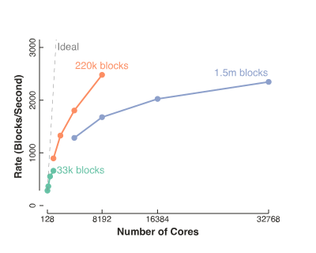

+++
title = 'Formal Metrics for Large-Scale Parallel Performance'
+++

  

{}Formal Metrics for Large-Scale Parallel
Performance{}. Kenneth Moreland and Ron Oldfield.
In _High Performance Computing_, July 2015. DOI
[10.1007/978-3-319-20119-1_34](https://dx.doi.org/10.1007/978-3-319-20119-1_34).

## Abstract

Performance measurement of parallel algorithms is well studied and well
understood. However, a flaw in traditional performance metrics is that they rely
on comparisons to serial performance with the same input. This comparison is
convenient for theoretical complexity analysis but impossible to perform in
large-scale empirical studies with data sizes far too large to run on a single
serial computer. Consequently, scaling studies currently rely on ad hoc methods
that, although effective, have no grounded mathematical models. In this position
paper we advocate using a rate-based model that has a concrete meaning relative
to speedup and efficiency and that can be used to unify strong and weak scaling
studies.

## Full Paper

{}[Formal Metrics for Large-Scale Parallel Performance](FormalScalingMetric.pdf){}

## Supplemental Material

You can easily use any spreadsheet program (such as Microsoft Excel) or any
other plotting program to generate plots based on the metrics in this paper. The
plots in this paper were generated with a Python module called [toyplot]. I
built the scripts as self-documenting [IPython notebooks] and provide them here
as supplemental material for examples on how to compute and use these metrics.
Even if you do not plan to use the same tools I am using, you might find detail
useful when replicating the detail yourself. You can [download the archive of
scripts, data, and results] or you can browse the material in the following web
pages.

* [Fabricated data from idealized performance and
  overhead](parallel-scaling-plots/PerfectModels.html). This data is not used in
  the paper, but I often use these figures when presenting the work.
* [Data from a real, good scaling parallel
  algorithm](parallel-scaling-plots/Habib2013.html). This is the source for
  Figures 1 and 2 in the paper.
* [Data from a real, poorly scaling parallel
  algorithm](parallel-scaling-plots/Oldfield2014.html). This is the source for
  Figures 3 and 4 in the paper.

You can also [download the presentation slides] I used at ISC 2015. These slides do not give enough explanation to really understand the concepts (that is what the speaker and paper are for), but it might be useful if you want to present this information to others.

[toyplot]: https://toyplot.readthedocs.org/
[IPython notebooks]: https://ipython.org/notebook.html
[download the archive of scripts, data, and results]: parallel-scaling-plots.tar.gz
[download the presentation slides]: FormalScalingMetric.pptx
