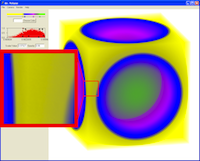

+++
title = 'Volume Rendering with Partial Pre-Integration'
+++

  

This page provides my Ph.D. thesis, related publication, and supplemental
materials. Several volume rendering techniques are presented, but the most novel
and interesting of them is the **partial pre-integration** technique. The idea
of the partial pre-integration technique is to build pre-computed tables that
can be used to speed the computation of the radiative transfer computation
required for volume rendering. The partial pre-integration technique is similar
to the [pre-integrated] technique except that the tables for this later
technique embed a particular transfer function. In contrast, the same tables for
partial pre-integration can be used for any volume rendering (assuming piecewise
linear interpolation of material properties is used). Partial pre-integration
can also be used to build the tables for pre-integration.

## Publications

{}Fast High Accuracy Volume Rendering{}.
Kenneth Moreland.
PhD thesis, University of New Mexico, July 2004.

* [A "small" web document (2.7 MB)](thesis.pdf)
* [A paper quality version (15 MB)](thesis_paperq.pdf)
* You may also review [the slides presented at my defense](PhD_Defense.ppt).

{}A Fast High Accuracy Volume Renderer for Unstructured Data{}.
Kenneth Moreland and Edward Angel.
In _IEEE Symposium on Volume Visualization and Graphics_, pages 9–16, October 2004.
[doi:10.1109/SVVG.2004.2](https://dx.doi.org/10.1109/SVVG.2004.2).

* [The full paper](volvis04.pdf)
* (Note that the title of this paper is a play off an earlier [paper by Williams, Max, and Stein]. At the time I thought this would be clever way to gain visibility, but now it just feels like a cheap trick.)

## Supplemental Material

I also captured source code relating to the work to help repeat this work.

* [Vertex and fragment programs](sushi.cg) (in Cg) used for the rendering
* [The 512x512 Psi table](PsiGammaTable.h)
* [The 1024x1024 Psi table](PsiGammaTable.c.gz)

For those of you who are really adventurous, I have also archived the rest of
the source code I generated during my Ph.D. program. The code is contained in a
makeshift library called On-Card Algorithms (OCA). It's basically a bunch of
boilerplate encapsulated in C++ objects to run Cg algorithms that do not fit
will within the classical graphics pipeline. You may or may not find that useful
although now there are more complete solutions such as [CUDA], [OpenCL], and
many others now available.

In this archive is also the collection of algorithms I happened to be working on
at the time, such as [The FFT on a GPU]. You may enjoy looking through them
although many will probably be a bit worthless and other may not even work.

[Download oca.tar.gz](oca.tar.gz)

You will need [CMake] in order to compile this code.

---

Thanks to James Derrick for his tireless and complimentary proofreading.

[pre-integrated]: https://wwwvis.informatik.uni-stuttgart.de/~engel/pre-integrated/
[paper by Williams, Max, and Stein]: https://dx.doi.org/10.1109/2945.675650
[CUDA]: https://www.nvidia.com/object/cuda_home.html
[OpenCL]: https://www.khronos.org/opencl/
[The FFT on a GPU]: /fftgpu/
[CMake]: https://www.cmake.org/
