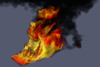

+++
title = 'Large-Scale Parallel Rendering'
+++

  

In this work we explore large-scale parallel rendering on HPC systems. The major
deployment platform for this work is the scalable rendering library [IceT],
which is made freely available. Our main approach is a technique known as
sort-last parallel rendering, but along the way we introduce several simple to
implement but powerful modifications that greatly improve the efficiency
including minimal copy image interlacing for better load balancing and
telescoping compositing for arbitrary job sizes. Visit the [IceT] project page
for access to the software, documentation, and further papers and information on
scalable rendering. For users more interested in easy to read and edit code than
high efficiency, we also provide the [miniGraphics] miniapp.

[IceT]: https://gitlab.kitware.com/icet/icet
[miniGraphics]: https://github.com/sandialabs/miniGraphics

# GPU-based Compression for Distributed Rendering

{}GPU-based Image Compression for Efficient Compositing in Distributed Rendering Applications{}.
Riley Lipinksi, Kenneth Moreland, Michael E. Papka, and Thomas Marrinan.
In _2021 IEEE 11th Symposium on Large Data Analysis and Visualization (LDAV)_, pages 43–52, 2021.
[doi:10.1109/LDAV53230.2021.00012](https://dx.doi.org/10.1109/LDAV53230.2021.00012).

## Abstract

Visualizations of large-scale data sets are often created on graphics clusters
that distribute the rendering task amongst many processes. When using real-time
GPU-based graphics algorithms, the most time-consuming aspect of distributed
rendering is typically the com-positing phase - combining all partial images
from each rendering process into the final visualization. Compo siting requires
image data to be copied off the GPU and sent over a network to other processes.
While compression has been utilized in existing distributed rendering
compositors to reduce the data being sent over the network, this compression
tends to occur after the raw images are transferred from the GPU to main memory.
In this paper, we present work that leverages OpenGL / CUDA interoperability to
compress raw images on the GPU prior to transferring the data to main memory.
This approach can significantly reduce the device-to-host data transfer time,
thus enabling more efficient compositing of images generated by distributed
rendering applications.

## Full Paper

{}[GPU-based Image Compression for Efficient Compositing in Distributed Rendering Applications]{}

[GPU-based Image Compression for Efficient Compositing in Distributed Rendering Applications]: icet-gpu-compression.pdf

# Binary-Swap on Odd Factors of Processes

{}Comparing Binary-Swap Algorithms for Odd Factors of Processes{}.
Kenneth Moreland.
In _Proceedings of the 8th IEEE Symposium on Large Data Analysis and Visualization (LDAV)_, October 2018.
[doi:10.1109/LDAV.2018.8739210](https://dx.doi.org/10.1109/LDAV.2018.8739210).

## Abstract

A key component of most large-scale rendering systems is a parallel image
compositing algorithm, and the most commonly used compositing algorithms are
binary swap and its variants. Although shown to be very efficient, one of the
classic limitations of binary swap is that it only works on a number of
processes that is a perfect power of 2. Multiple variations of binary swap have
been independently introduced to overcome this limitation and handle process
counts that have factors that are not 2. To date, few of these approaches have
been directly compared against each other, making it unclear which approach is
best. This paper presents a fresh implementation of each of these methods using
a common software framework to make them directly comparable. These methods to
run binary swap with odd factors are directly compared. The results show that
some simple compositing approaches work as well or better than more complex
algorithms that are more difficult to implement.

## Full Paper

[Comparing Binary-Swap Algorithms for Odd Factors of Processes]

[Comparing Binary-Swap Algorithms for Odd Factors of Processes]: BinarySwapNon2.pdf

## Supplemental Material

Here are [the slides used to present this material]. The slides really need a narrator to explain the algorithms, but they have nice animations that help describe the content.

[the slides used to present this material]: https://1drv.ms/p/s!Aub-LzOy6dCvgWWI3myPagTlEKGs

The software used for testing in this paper is being made available in the [miniGraphics] miniapp, which is released as open-source software and is made available through [a GitHub repository]. The experiments were specifically performed with the repository at SHA [50630f9] with the exception of the 234-composite algorithm (which was implemented afterward). These use the code at SHA [4e647c2]. If you really want to replicate the exact same code for reproducibility, you can [download this exact version]. For most purposes, though, you are probably better off with [the latest version of miniGraphics].

[a GitHub repository]: https://github.com/sandialabs/miniGraphics
[50630f9]: https://github.com/sandialabs/miniGraphics/tree/50630f94848b970cc8894eb0ceb84b47bcef20f5
[4e647c2]: https://github.com/sandialabs/miniGraphics/tree/4e647c2bb7fe5b77a1d5340c3480b146dcbf3947
[download this exact version]: https://github.com/sandialabs/miniGraphics/archive/4e647c2bb7fe5b77a1d5340c3480b146dcbf3947.zip
[the latest version of miniGraphics]: https://github.com/sandialabs/miniGraphics

For those interested in exploring the data collected by the reported experiments
more thoroughly, I also post all the log files collected through the experiments
here. The [miniGraphics] application writes out its timing measurements in yaml
format. Because these timing logs can get verbose, each are compressed with
gzip.

* [miniGraphics-skybridge-vn-scaling.yaml.gz] Measurements of the system when
  running in "virtual node" mode. This is where most of the data from Section
  3.1 comes from.
* [miniGraphics-skybridge-vn-corrections.yaml.gz] As noted in Section 3.4.3, a
  few inconsistent readings are observed. These are likely due to aberrant
  system slowdowns and so were re-run. The measurements in this file replace
  those in miniGraphics-skybridge-vn-scaling.yaml.gz.
* [miniGraphics-skybridge-vn-no-compress.yaml.gz] A subset of measurements run
  without using image compression. These results are reported in Section 3.2.
* [miniGraphics-skybridge-smp-scaling.yaml.gz] Similar to the "virtual node"
  scaling studies, these experiments are run in "pure distributed" mode where
  every MPI process was on a separate compute node. These results are reported
  in Section 3.3 (although many of these measurements are not reported in the
  paper due to limited space).

[miniGraphics-skybridge-vn-scaling.yaml.gz]: https://github.com/kmorel-papers/BinarySwapNon2/raw/master/data/miniGraphics-skybridge-vn-scaling.yaml.gz
[miniGraphics-skybridge-vn-corrections.yaml.gz]: https://github.com/kmorel-papers/BinarySwapNon2/raw/master/data/miniGraphics-skybridge-vn-corrections.yaml.gz
[miniGraphics-skybridge-vn-no-compress.yaml.gz]: https://github.com/kmorel-papers/BinarySwapNon2/raw/master/data/miniGraphics-skybridge-vn-no-compress.yaml.gz
[miniGraphics-skybridge-smp-scaling.yaml.gz]: https://github.com/kmorel-papers/BinarySwapNon2/raw/master/data/miniGraphics-skybridge-smp-scaling.yaml.gz

The figures in the paper are created in Python using [pandas] and [toyplot]
modules. I also execute the Python script in [Jupyter notebooks]. These
notebooks are provided for you to either directly run, copy into your own
scripts, or use as inspiration for whatever processing you prefer.

[pandas]: https://pandas.pydata.org/
[toyplot]: https://toyplot.readthedocs.io/
[Jupyter notebooks]: http://jupyter.org/

* [scaling-plots.ipynb] The basic scaling plots generating the first two figures
  of Section 3.1.
* [2-3-swap-overhead.ipynb] A plot of the overhead of building the composite
  tree for the 2-3 swap algorithm. Creates the last figure of Section 3.1.
* [no-image-compress.ipynb] The scaling plots when not using image compression.
  Creates the figures of Section 3.2.
* [vn-vs-smp.ipynb] Plots comparing the behavior of virtual node vs. pure
  virtual modes. Creates the figures of Section 3.3.

[scaling-plots.ipynb]: https://github.com/kmorel-papers/BinarySwapNon2/blob/master/data/scaling-plots.ipynb
[2-3-swap-overhead.ipynb]: https://github.com/kmorel-papers/BinarySwapNon2/blob/master/data/2-3-swap-overhead.ipynb
[no-image-compress.ipynb]: https://github.com/kmorel-papers/BinarySwapNon2/blob/master/data/no-image-compress.ipynb
[vn-vs-smp.ipynb]: https://github.com/kmorel-papers/BinarySwapNon2/blob/master/data/vn-vs-smp.ipynb

# An Image Compositing Solution at Scale

{}An Image Compositing Solution at Scale{}.
Kenneth Moreland, Wesley Kendall, Tom Peterka, and Jian Huang.
In _Proceedings of 2011 International Conference for High Performance Computing, Networking, Storage and Analysis (SC '11)_, November 2011.
[doi:10.1145/2063384.2063417](https://dx.doi.org/10.1145/2063384.2063417).

## Abstract

The only proven method for performing distributed-memory parallel rendering at
large scales, tens of thousands of nodes, is a class of algorithms called sort
last. The fundamental operation of sort-last parallel rendering is an image
composite, which combines a collection of images generated independently on each
node into a single blended image. Over the years numerous image compositing
algorithms have been proposed as well as several enhancements and rendering
modes to these core algorithms. However, the testing of these image compositing
algorithms has been with an arbitrary set of enhancements, if any are applied at
all. In this paper we take a leading production-quality image compositing
framework, IceT, and use it as a testing framework for the leading image
compositing algorithms of today. As we scale IceT to ever increasing job sizes,
we consider the image compositing systems holistically, incorporate numerous
optimizations, and discover several improvements to the process never considered
before. We conclude by demonstrating our solution on 64K cores of the Intrepid
BlueGene/P at Argonne National Laboratories.

## Full Paper

{}[An Image Compositing Solution at Scale]{}

[An Image Compositing Solution at Scale]: https://dl.acm.org/doi/10.1145/2063384.2063417?cid=81100570201

## Supplemental Material

You can download [the artifacts generated for this paper]. This is a collection
of the raw timing data collected during the scaling studies.

[the artifacts generated for this paper]: IceTAtScaleArtifacts.tar.bz2

# Sort-Last Parallel Rendering on Tile Displays

{}Sort-Last Parallel Rendering for Viewing Extremely Large Data Sets on Tile Displays{}.
Kenneth Moreland, Brian Wylie, and Constantine Pavlakos.
In _Proceedings of the IEEE 2001 Symposium on Parallel and Large-Data Visualization and Graphics_, pages 85–92, October 2001.
[doi:10.1109/PVGS.2001.964408](https://dx.doi.org/10.1109/PVGS.2001.964408).

## Abstract

Due to the impressive price-performance of today’s PC- based graphics
accelerator cards, Sandia National Laboratories is attempting to use PC clusters
to render extremely large data sets in interactive applications. This paper
describes a sort-last parallel rendering system running on a PC cluster that is
capable of rendering enormous amounts of geometry onto high-resolution tile
displays by taking advantage of the spatial coherency that is inherent in our
data. Furthermore, it is capable of scaling to larger sized input data or higher
resolution displays by increasing the size of the cluster. Our prototype is now
capable of rendering 120 million triangles per second on a 12 mega-pixel
display.

## Full Paper

[Sort-Last Parallel Rendering for Viewing Extremely Large Data Sets on Tile Displays]

[Sort-Last Parallel Rendering for Viewing Extremely Large Data Sets on Tile Displays]: PVG2001.pdf
