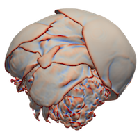

+++
title = 'Topology Computation on Many Threads'
+++

  

A challenging aspect of performing scientific visualization in a parallel
environment with many threads is finding common topology elements generated
concurrently by parallel threads. When parallel threads work on coarse regions
of topology (such as in an MPI environment) it is feasible (and common) to
simply allow coincident topology to be duplicated. When working with a processor
that requires many threads (such as a GPU), there is too much overlap to make
duplication feasible. In our research we developed techniques that built unique
keys to simplify the identification of common elements.

## Finely-Threaded History-Based Topology Computation

{}Finely-Threaded History-Based Topology Computation{}.
Robert Miller, Kenneth Moreland, and Kwan-Liu Ma.
In _Eurographics Symposium on Parallel Graphics and Visualization_, June 2014.
[doi:10.2312/pgv.20141083](https://dx.doi.org/10.2312/pgv.20141083).

In our initial research we explored the idea of defining a unique integer-based
identifier for each topological element. The key insight is that new topologies
are typically based on an input topology in visualization, and we can use the
indices of the source topology to formulate unique keys.

### Abstract

Graphics and visualization pipelines often make use of highly parallelized
algorithms which transform an input mesh into an output mesh. One example is
Marching Cubes, which transforms a voxel grid into a triangle mesh approximation
of an isosurface. These techniques often discard the topological connectivity of
the output mesh, and instead produce a ‘soup’ of disconnected geometric
elements. Calculations that require local neighborhood, such as surface
curvature, cannot be performed on such outputs without first reconstructing its
topology. We present a novel method for reconstructing topological information
across several kinds of mesh transformations, which we demonstrate with GPU and
OpenMP implementations. Our approach makes use of input topological elements for
efficient location of coincident elements in the output. We provide performance
data for the technique for isosurface generation, tetrahedralization,
subdivision, and dual mesh generation, and demonstrate its use in visualization
pipelines containing further computations of local curvature and mesh
coarsening.

### Full Paper

{}[Finely-Threaded History-Based Topology Computation]{}

[Finely-Threaded History-Based Topology Computation]: TopologyThreading.pdf

## Techniques for Data-Parallel Searching for Duplicate Elements

{}Techniques for Data-Parallel Searching for Duplicate Elements{}.
Brenton Lessley, Kenneth Moreland, Matthew Larsen, and Hank Childs.
In _IEEE Symposium on Large Data Analysis and Visualization (LDAV)_, October 2017.
[doi:10.1109/LDAV.2017.8231845](https://dx.doi.org/10.1109/LDAV.2017.8231845).

In this work, we explored the use of imperfect hashes as keys to identify common
topological elements. Although this results in key collisions, the correction
for collisions takes less time than the benefit of faster hash grouping. We also
explore a "hash-fight" algorithm for external faces that uses a different
technique for finding duplicate hashes.

### Abstract

We study effective shared-memory, data-parallel techniques for searching for
duplicate elements. We consider several data-parallel approaches, and how hash
function, machine architecture, and data set can affect performance. We conclude
that most choices of algorithm and hash function are problematic for general
usage. However, we demonstrate that the choice of the Hash-Fight algorithm with
the FNV1a hash function has consistently good performance over all
configurations.

### Full Paper

{}[Techniques for Data-Parallel Searching for Duplicate Elements]{}

[Techniques for Data-Parallel Searching for Duplicate Elements]: LDAV_hashing.pdf

### Supplemental Materials

#### Benchmarking Program

Use the following link to download the benchmarking program that we used to take the measurements provided by the paper.

[external-faces-benchmark-src.tar.gz](ldav-2017-timing/external-faces-benchmark-src.tar.gz)

Note that this code was writen for and run on an older version of [VTK-m]. To run this now, you will either have to update the source code or get an older version of VTK-m from the [git repository](https://gitlab.kitware.com/vtk/vtk-m).

[VTK-m]: https://m.vtk.org

#### Log Files

We also post here the raw files generated by our benchmarking runs. In the table
below, the left links are to the raw log file (either in YAML or CSV format).
The associated link to the right is a Jupyter/IPython file we used to process
the log files and generate the figures seen in the paper.

| Log File | Jupyter Python Script |
|----------|-----------------------|
| [external-faces-log-haswell-2017-04-19.yaml](ldav-2017-timing/external-faces-log-haswell-2017-04-19.yaml) | [external-faces-haswell.ipynb](https://github.com/kennethmoreland-com/kennethmoreland-com.github.io/blob/master/topology-threading/ldav-2017-timing/external-faces-haswell.ipynb) |
| [external-faces-log-knl-2017-04-13.yaml](ldav-2017-timing/external-faces-log-knl-2017-04-13.yaml) | [external-faces-knl.ipynb](https://github.com/kennethmoreland-com/kennethmoreland-com.github.io/blob/master/topology-threading/ldav-2017-timing/external-faces-knl.ipynb) |
| [external-faces-log-tesla-p100-2017-04-13.yaml](ldav-2017-timing/external-faces-log-tesla-p100-2017-04-13.yaml) | [external-faces-tesla-p100.ipynb](https://github.com/kennethmoreland-com/kennethmoreland-com.github.io/blob/master/topology-threading/ldav-2017-timing/external-faces-tesla-p100.ipynb) |
| [duplicate_hashes.csv](ldav-2017-timing/duplicate_hashes.csv) | [duplicate_hashes.ipynb](https://github.com/kennethmoreland-com/kennethmoreland-com.github.io/blob/master/topology-threading/ldav-2017-timing/duplicate_hashes.ipynb) |

## Efficient Point Merging Using Data Parallel Techniques

{}Efficient Point Merging Using Data Parallel Techniques{}.
Abhishek Yenpure, Hank Childs, and Kenneth Moreland.
In _Eurographics Symposium on Parallel Graphics and VIsualization (EGPGV)_, June 2019.
[doi:10.2312/pgv.20191112](https://dx.doi.org/10.2312/pgv.20191112).

Our previous work on finding common topology elements used identifiers derived
from known sources that could be enumerated. In this work, we find coincident
points in a general space. We do so by imposing a virtual topology in space (a
very fine uniform grid) that can be enumerated. We then sparsely represent the
points in this space and use that to find duplicate points.

### Abstract

We study the problem of merging three-dimensional points that are nearby or
coincident. We introduce a fast, efficient approach that uses data parallel
techniques for execution in various shared-memory environments. Our technique
incorporates a heuristic for efficiently clustering spatially close points
together, which is one reason our method performs well against other methods. We
then compare our approach against methods of a widely-used scientific
visualization library accompanied by a performance study that shows our approach
works well with different kinds of parallel hardware (many-core CPUs and NVIDIA
GPUs) and data sets of various sizes.

### Full Paper

{}[Efficient Point Merging Using Data Parallel Techniques]{}

[Efficient Point Merging Using Data Parallel Techniques]: point-merge-egpgv2019.pdf

### Supplemental Materials

#### Benchmarking Program

Use the following link to download the benchmarking program that we used to take
the measurements provided by the paper.

[point-merge-benchmarks-src.tar.gz](point-merge-egpgv2019/point-merge-benchmarks-src.tar.gz)

Note that this code was writen for and run on an older version of [VTK-m]. To run this now, you will either have to update the source code or get an older version of VTK-m from the [git repository](https://gitlab.kitware.com/vtk/vtk-m).

#### Data Files

Use the following link to download the data sets used with the aforementioned
benchmarking program. Included in the archive file are the three surface data
sets used in the paper.

[point-merge-datasets.tar.gz](https://1drv.ms/u/s!Aub-LzOy6dCvgXC6706B4lQsyFIB?e=ozEdzd)

#### Log Files

Use the following link to download the raw files generated by our benchmarking
runs. Included in the archive file are some helpful Python scripts to parse the
logs and generate plots.

[point-merge-benchmarks-logs.tar.gz](point-merge-egpgv2019/point-merge-benchmarks-logs.tar.gz)
