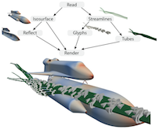

+++
title = 'A Survey of Visualization Pipelines'
+++

  

{}A Survey of Visualization Pipelines{}.
Kenneth Moreland.
_IEEE Transactions on Visualization and Computer Graphics_, 3, 19(3):367–378, March 2013.
[doi:10.1109/TVCG.2012.133](https://dx.doi.org/10.1109/TVCG.2012.133).

## Abstract

The most common abstraction used by visualization libraries and applications
today is what is known as the visualization pipeline. The visualization pipeline
provides a mechanism to encapsulate algorithms and then couple them together in
a variety of ways. The visualization pipeline has been in existence for over
twenty years, and over this time many variations and improvements have been
proposed. This paper provides a literature review of the most prevalent features
of visualization pipelines and some of the most recent research directions.

## Full Paper

{}[A Survey of Visualization Pipelines]{}

[A Survey of Visualization Pipelines]: VisPipelines.pdf
